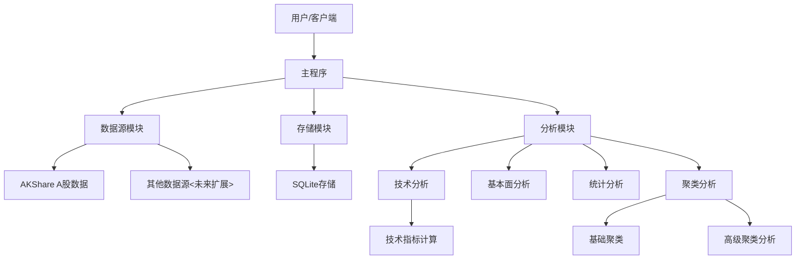

# BeeShare系统

## 项目概述

这是一个专注于中国A股市场的数据获取和分析系统。系统利用AKShare数据源获取A股历史和实时行情数据，并支持本地存储。整个系统设计为模块化架构，方便扩展和维护。

## 系统架构



## 主要功能

1. **数据源支持**：
   - AKShare (专注中国A股市场)
   - 未来可扩展更多A股数据源

2. **数据获取能力**：
   - A股历史行情数据（日K、周K、月K）
   - A股实时行情数据
   - A股股票信息搜索和查询
   - A股指数数据获取（上证指数、深证成指、沪深300等）
   - **股票代码信息识别**（主板、创业板、科创板等）

3. **数据存储方式**：
   - SQLite数据库存储（支持高级查询和优化）

4. **数据分析功能**：
   - **技术分析**：移动平均线、MACD、RSI、KDJ、布林带等指标计算
   - **基本面分析**：估值分析、成长性分析、盈利能力分析、偿债能力分析、股息分析等
   - **统计分析**：收益率统计、风险指标计算、分布分析、相关性分析等
   - **可视化**：各类分析结果的可视化展示
   - **聚类分析**：使用KMeans算法对股票进行分组聚类分析，发现相似特征的股票

5. **新增功能**：
   - **高级聚类分析**：结合多种技术指标的聚类分析，自动寻找最佳聚类数，多维可视化
   - **技术指标库**：全面的技术指标计算工具，支持动量、波动性、成交量和趋势指标
   - **增强的日志和异常处理**：更详细的日志记录和更精确的异常处理机制

## 配置说明

配置文件位于`config/config.py`，包含以下主要配置项：

- 数据源配置 (DATA_SOURCES)
- 数据获取配置 (FETCH_CONFIG)
- 存储配置 (STORAGE_CONFIG)
- 目标市场配置 (MARKETS)
- 日志配置 (LOG_CONFIG)

## 使用方法

可以通过命令行参数使用该系统：

```bash
# 获取历史行情数据
python main.py historical --symbol 600036 --start 2023-01-01 --end 2023-12-31

# 获取实时行情数据
python main.py realtime --symbol 600519,601398

# 使用市场代码获取实时行情数据（A股市场默认股票）
python main.py realtime --market cn

# 搜索股票
python main.py search --keyword 贵州茅台

# 获取指数数据
python main.py index --symbol 000001 --start 2023-01-01 --end 2023-12-31

# 识别股票代码信息
python main.py identify --symbol 600519,001279,300059,688001
```

### 存储管理命令

系统现在只支持SQLite存储：

```bash
# 查看当前存储状态
python main.py storage --status

# 优化SQLite数据库
python main.py storage --optimize
```

有关存储方案的详细说明，请参考[存储方案指南](docs/storage_guide.md)。

## 分析模块使用

系统提供了强大的分析功能，可以通过以下方式使用：

### 基本面分析

可以通过调用相应的API进行基本面分析。

### 聚类分析

```bash
# 使用聚类分析命令
python main.py clustering --symbols 600519,601398,600036,000001 --n-clusters 3 --features open,close,high,low,volume,change_percent

# 聚类分析支持的参数：
# --symbols: 要分析的股票代码，用逗号分隔
# --start-date: 起始日期 (默认为90天前)
# --end-date: 结束日期 (默认为今天)
# --n-clusters: 聚类数量 (默认为3)
# --features: 用于聚类的特征，用逗号分隔
# --find-optimal: 自动寻找最佳聚类数量
# --max-clusters: 最大聚类数量 (与find-optimal一起使用，默认为10)
# --plot-type: 可视化类型 (clusters/elbow/feature_distribution/centroids/all)
# --output-dir: 结果输出目录
# --use-pca: 使用PCA降维进行可视化
# --plot-3d: 绘制3D聚类图
# --source: 数据源，默认为"akshare"
```

## 技术指标库

系统提供了全面的技术指标计算工具，可用于分析和聚类：

### 技术指标分类

1. **动量指标**
   - RSI (相对强弱指数)：衡量价格变动的强度，判断超买超卖
   - MACD (移动平均线收敛/发散)：判断趋势方向和强度，以及可能的反转点
   - CCI (商品通道指数)：识别周期性超买或超卖条件

2. **波动性指标**
   - 布林带：显示价格波动的范围，包括上轨、中轨和下轨
   - ATR (真实波动幅度均值)：测量市场波动性，忽略价格跳空

3. **成交量指标**
   - OBV (能量潮)：累计成交量以确认价格趋势
   - MFI (资金流量指标)：结合价格和成交量的动量指标

4. **趋势指标**
   - ADX (平均方向指数)：测量趋势强度，不考虑趋势方向
   - Aroon (阿隆指标)：识别趋势开始和结束，以及趋势强度

### 示例用法

```python
from src.utils.technical_indicators import add_technical_indicators

# 添加所有技术指标
enhanced_data = add_technical_indicators(stock_data)

# 添加特定类别的指标
from src.utils.technical_indicators import add_momentum_indicators
momentum_data = add_momentum_indicators(stock_data)
```

## 日志和异常处理系统

BeeShare系统配备了强大的日志记录和异常处理机制，可以帮助用户更好地定位和解决问题。

### 日志系统特点

- **分级日志**：支持DEBUG、INFO、WARNING、ERROR和CRITICAL多个级别
- **彩色控制台输出**：不同级别使用不同颜色，易于识别
- **详细的文件日志**：记录完整的时间戳、模块路径、行号和上下文信息
- **函数调用跟踪**：DEBUG级别下可以记录函数调用、参数和返回值

### 异常处理特点

- **层次化异常**：根据不同模块和功能定义专门的异常类型
- **详细的错误信息**：包含原始异常、问题位置和上下文信息
- **智能恢复机制**：尝试从错误中恢复，如使用缓存数据或默认值
- **用户友好消息**：提供易于理解的错误消息和可能的解决方案

有关日志和异常处理的详细信息，请参考[日志和异常处理指南](docs/logging_guide.md)。

## API文档

系统提供了以下核心API。**更详细的API使用说明请参考 [API使用指南](docs/api_guide.md)**。

### 数据源API (AKShareDS类)

1. **get_historical_data(symbol, start_date, end_date, interval)**
   - 功能：获取A股历史数据
   - 参数：
     - symbol: 股票代码
     - start_date: 开始日期，格式YYYY-MM-DD
     - end_date: 结束日期，格式YYYY-MM-DD
     - interval: 数据间隔，支持'daily', 'weekly', 'monthly'

2. **get_realtime_data(symbols)**
   - 功能：获取A股实时数据
   - 参数：
     - symbols: 股票代码列表

3. **search_symbols(keyword)**
   - 功能：搜索A股股票信息
   - 参数：
     - keyword: 搜索关键词

4. **get_index_data(symbol, start_date, end_date, interval)**
   - 功能：获取指数数据（如上证指数、深证成指等）
   - 参数：
     - symbol: 指数代码，如'000001'(上证指数),'399001'(深证成指),'000300'(沪深300)
     - start_date: 开始日期，格式YYYY-MM-DD
     - end_date: 结束日期，格式YYYY-MM-DD
     - interval: 数据间隔，默认'daily'

5. **_identify_stock_type(symbol)**
   - 功能：识别股票代码的类型信息（板块、交易所等）
   - 参数：
     - symbol: 股票代码
   - 返回：
     - 包含股票类型信息的字典（市场、交易所、板块、前缀等）

### 存储API (SQLiteStorage类)

1. **save_data(data, data_type, symbol, mode)**
   - 功能：保存数据到SQLite数据库
   - 参数：
     - data: 要保存的数据(DataFrame)
     - data_type: 数据类型，使用DataType枚举，如DataType.HISTORICAL
     - symbol: 股票代码
     - mode: 保存模式，'append'或'overwrite'

2. **load_data(data_type, symbol, start_date, end_date)**
   - 功能：从SQLite数据库加载数据
   - 参数：
     - data_type: 数据类型，使用DataType枚举
     - symbol: 股票代码
     - start_date: 起始日期
     - end_date: 结束日期

### 分析API

#### 技术分析 (TechnicalAnalyzer类)

1. **analyze(methods=None, params=None)**
   - 功能：执行技术分析，计算各种技术指标
   - 参数：
     - methods: 要执行的分析方法列表，如['ma', 'macd', 'rsi']
     - params: 分析参数字典
   - 返回：
     - 包含分析结果的DataFrame

2. **visualize(data=None, indicators=None, start_date=None, end_date=None, title=None)**
   - 功能：可视化技术分析结果
   - 参数：
     - data: 要可视化的数据
     - indicators: 要可视化的指标列表
     - start_date: 开始日期
     - end_date: 结束日期
     - title: 图表标题

#### 基本面分析 (FundamentalAnalyzer类)

1. **analyze(methods=None, params=None)**
   - 功能：执行基本面分析，包括估值、成长性、盈利能力等分析
   - 参数：
     - methods: 要执行的分析方法列表，如['valuation', 'growth', 'profitability']
     - params: 分析参数字典
   - 返回：
     - 包含分析结果的字典

2. **visualize(result=None, plot_type='overview', **kwargs)**
   - 功能：可视化基本面分析结果
   - 参数：
     - result: 分析结果字典
     - plot_type: 图表类型，如'overview', 'valuation', 'growth'等
     - **kwargs: 其他绘图参数

#### 统计分析 (StatisticalAnalyzer类)

1. **analyze(methods=None, params=None)**
   - 功能：执行统计分析，包括收益率、风险、分布等分析
   - 参数：
     - methods: 要执行的分析方法列表，如['returns', 'risk', 'distribution']
     - params: 分析参数字典
   - 返回：
     - 包含分析结果的字典

2. **visualize(result=None, plot_type='returns', **kwargs)**
   - 功能：可视化统计分析结果
   - 参数：
     - result: 分析结果字典
     - plot_type: 图表类型，如'returns', 'risk', 'distribution'等
     - **kwargs: 其他绘图参数

#### 聚类分析 (ClusteringAnalyzer类)

1. **run_kmeans_clustering(features, n_clusters=3, **kwargs)**
   - 功能：执行KMeans聚类分析
   - 参数：
     - features: 用于聚类的特征列表
     - n_clusters: 聚类数量
     - **kwargs: 其他KMeans参数
   - 返回：
     - 包含聚类结果的字典
     
2. **determine_optimal_clusters(max_clusters=10, **kwargs)**
   - 功能：确定最佳的聚类数量（使用肘部法则）
   - 参数：
     - max_clusters: 最大聚类数量
     - **kwargs: KMeans参数
   - 返回：
     - (最佳聚类数, 惯性值列表)

3. **visualize(result=None, plot_type='clusters', **kwargs)**
   - 功能：可视化聚类结果
   - 参数：
     - result: 聚类结果字典
     - plot_type: 图表类型，如'clusters', 'elbow', 'feature_distribution', 'centroids'
     - **kwargs: 其他绘图参数，如use_pca, plot_3d等

### 技术指标API (technical_indicators.py)

1. **add_technical_indicators(df, include_all=False)**
   - 功能：为股票数据添加技术指标
   - 参数：
     - df: 股票数据DataFrame
     - include_all: 是否计算所有可能的技术指标
   - 返回：
     - 添加了技术指标的DataFrame

2. **add_momentum_indicators(df)**
   - 功能：添加动量指标(RSI, MACD, CCI)
   - 参数：
     - df: 股票数据DataFrame
   - 返回：
     - 添加了动量指标的DataFrame

3. **add_volatility_indicators(df)**
   - 功能：添加波动性指标(布林带, ATR)
   - 参数：
     - df: 股票数据DataFrame
   - 返回：
     - 添加了波动性指标的DataFrame

4. **add_volume_indicators(df)**
   - 功能：添加成交量指标(OBV, MFI)
   - 参数：
     - df: 股票数据DataFrame
   - 返回：
     - 添加了成交量指标的DataFrame

5. **add_trend_indicators(df)**
   - 功能：添加趋势指标(ADX, Aroon)
   - 参数：
     - df: 股票数据DataFrame
   - 返回：
     - 添加了趋势指标的DataFrame

## 聚类分析结果解读

聚类分析可以帮助发现股票的相似模式。结果通常包括：

1. **聚类中心点**：每个聚类的特征平均值，代表该组的特征特点
2. **簇内样本分布**：每个聚类包含的股票交易日数量及百分比
3. **特征重要性**：哪些特征对聚类结果影响最大
4. **各股票的聚类归属**：各股票主要属于哪个聚类

### 可视化类型

系统提供多种聚类结果可视化方式：

1. **聚类散点图**：展示样本在特征空间的分布和聚类情况
2. **肘部法则图**：用于确定最佳聚类数量
3. **轮廓系数图**：评估聚类质量
4. **特征分布图**：展示各聚类在不同特征上的分布
5. **中心点雷达图**：直观展示各聚类的特征特点
6. **日历热图**：展示聚类结果在时间上的分布

## 项目目录结构

```
beeshare/
├── config/                  # 配置文件
│   ├── config.py           # 主配置文件
│   └── storage.json        # 存储配置文件
├── data/                    # 数据存储目录
│   └── stock_data.db       # SQLite数据库文件
├── docs/                    # 文档
│   ├── api_guide.md        # API使用指南
│   ├── storage_guide.md    # 存储方案指南
│   ├── logging_guide.md    # 日志和异常处理指南
│   └── 聚类分析模块说明.md  # 聚类分析说明
├── logs/                    # 日志文件
├── results/                 # 分析结果输出
├── src/                     # 源代码
│   ├── analysis/           # 分析模块
│   │   ├── technical.py    # 技术分析
│   │   ├── fundamental.py  # 基本面分析
│   │   ├── statistical.py  # 统计分析
│   │   └── clustering.py   # 聚类分析
│   ├── data_sources/       # 数据源模块
│   │   ├── base.py         # 数据源基类
│   │   └── akshare.py      # AKShare数据源实现
│   ├── storage/            # 存储模块
│   │   ├── base.py         # 存储基类
│   │   ├── config.py       # 存储配置管理
│   │   ├── factory.py      # 存储工厂类
│   │   └── sqlite_storage.py # SQLite存储实现
│   └── utils/              # 工具函数
│       ├── technical_indicators.py # 技术指标计算
│       ├── exceptions.py   # 自定义异常类
│       └── logging_utils.py # 日志工具
├── tools/                   # 工具脚本
├── tests/                   # 测试代码
├── main.py                  # 主程序入口
├── README.md                # 项目说明
└── requirements.txt         # 依赖包列表
```

## 贡献指南

欢迎贡献代码、报告问题或提出功能建议。具体步骤请参考[贡献指南](docs/contributing.md)。

## 许可证

本项目采用 MIT 许可证。 