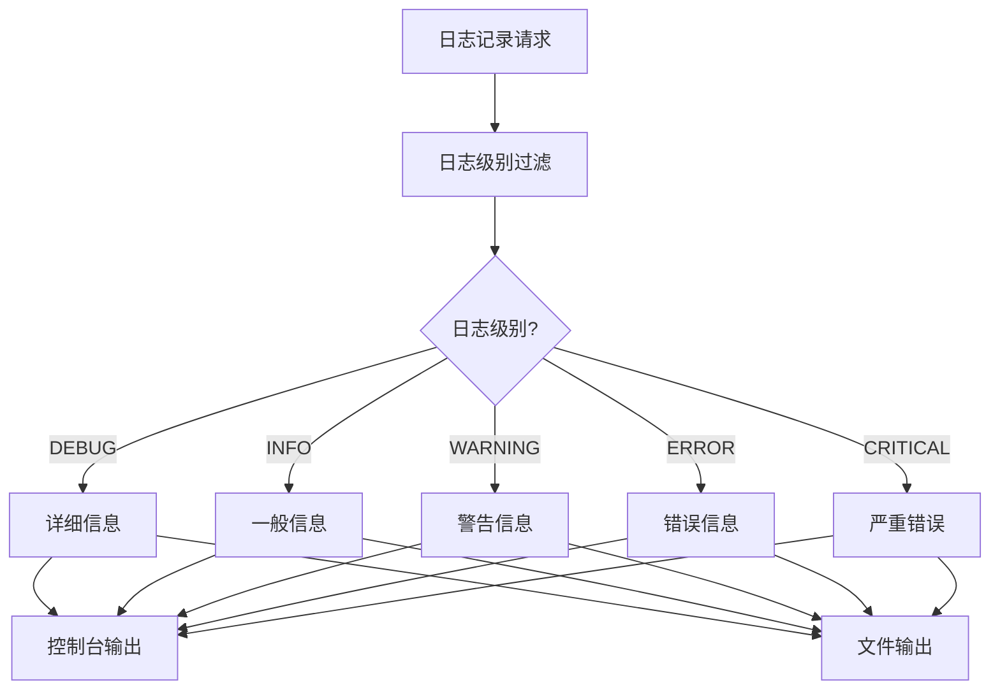
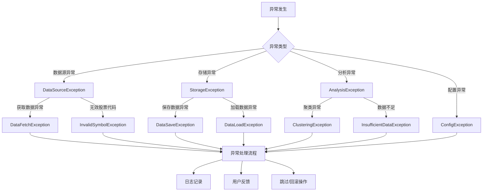

# BeeShare系统日志和异常处理指南

本文档介绍BeeShare系统的日志记录和异常处理机制，旨在帮助开发者和用户理解系统的错误处理流程，提高问题诊断和解决能力。

## 目录

- [日志系统设计](#日志系统设计)
- [异常处理机制](#异常处理机制)
- [开发者使用指南](#开发者使用指南)
- [用户故障排除指南](#用户故障排除指南)

## 日志系统设计



### 日志级别和使用场景

BeeShare系统使用Python标准日志模块，定义了以下日志级别：

| 级别 | 颜色 | 使用场景 |
|------|-----|--------|
| DEBUG | 青色 | 详细的调试信息，包括函数调用、参数和返回值 |
| INFO | 绿色 | 常规操作信息，如数据获取、保存成功等 |
| WARNING | 黄色 | 可能的问题，但不影响程序继续运行 |
| ERROR | 红色 | 发生错误，但可能部分功能仍可用 |
| CRITICAL | 紫色 | 严重错误，系统无法正常工作 |

### 日志格式

系统使用以下格式记录日志：

- **控制台输出**：`时间戳 [日志级别] [模块名] - 消息内容`
- **文件输出**：`时间戳 [日志级别] [模块名:行号] [进程ID:线程ID] - 消息内容`

在DEBUG级别下，系统会记录更详细的上下文信息。

### 日志文件位置

日志文件默认保存在`logs/stock_data.log`。日志文件会随时间增长，建议定期检查和清理。

## 异常处理机制



### 异常层次结构

系统使用层次化的异常结构，以便更精确地处理和诊断问题：

- **BeeShareException**：所有系统异常的基类
  - **DataSourceException**：数据源相关异常
    - **DataFetchException**：获取数据失败
    - **InvalidSymbolException**：无效的股票代码
  - **StorageException**：存储相关异常
    - **DataSaveException**：保存数据失败
    - **DataLoadException**：加载数据失败
  - **AnalysisException**：分析相关异常
    - **ClusteringException**：聚类分析异常
    - **InsufficientDataException**：数据不足异常
  - **ConfigException**：配置相关异常

### 异常处理策略

系统对异常的处理遵循以下策略：

1. **记录详细信息**：每个异常都会记录到日志，包括原始异常和堆栈跟踪
2. **向用户提供反馈**：使用易于理解的信息向用户解释问题
3. **安全处理**：确保异常不会导致系统崩溃，尽可能优雅地处理问题
4. **恢复机制**：当可能时自动尝试恢复，如使用缓存数据或默认值

## 开发者使用指南

### 日志工具

系统提供了以下日志工具，开发者可以在代码中使用：

#### 1. 设置日志记录器

```python
from src.utils.logging_utils import setup_logger

# 创建模块专用的日志记录器
logger = setup_logger('my_module', 'logs/my_module.log', 'DEBUG')
```

#### 2. 函数调用日志装饰器

```python
from src.utils.logging_utils import log_function_call

@log_function_call(level='DEBUG')
def my_function(arg1, arg2):
    # 函数实现
    return result
```

此装饰器会自动记录：
- 函数被调用的时间和参数
- 函数返回的结果
- 如果发生异常，会记录异常信息

#### 3. 异常日志上下文管理器

```python
from src.utils.logging_utils import log_exception

# 记录代码块中的异常
with log_exception(logger, reraise=True, level='ERROR'):
    # 可能抛出异常的代码
    result = process_data()
```

### 使用自定义异常

开发者应当使用系统提供的自定义异常而不是通用异常：

```python
from src.utils.exceptions import DataFetchException

# 不推荐
raise Exception("获取股票数据失败")

# 推荐
raise DataFetchException("获取股票数据失败", source="akshare", symbol="600519")
```

### 异常捕获最佳实践

```python
try:
    # 可能抛出异常的代码
    data = fetch_stock_data(symbol)
except DataFetchException as e:
    # 处理特定类型的异常
    logger.error(f"获取数据失败: {e}")
    # 可能的恢复策略
    data = get_cached_data(symbol)
except Exception as e:
    # 处理未预期的异常
    logger.error(f"未预期的错误: {e}")
    logger.debug(f"异常详情: {traceback.format_exc()}")
    # 默认恢复策略
    data = pd.DataFrame()
```

## 用户故障排除指南

### 常见错误及解决方法

#### 1. 数据获取错误

**错误示例**：`获取股票 600519 数据时出错: 'str' object has no attribute 'value'`

**可能原因**：
- 数据类型使用错误
- 网络连接问题
- 股票代码无效或不存在

**解决方法**：
- 检查股票代码是否正确
- 确认网络连接正常
- 尝试使用不同的数据源

#### 2. 存储错误

**错误示例**：`保存 HISTORICAL 数据失败: 必须提供symbol参数`

**可能原因**：
- 缺少必要的参数
- 数据格式不正确

**解决方法**：
- 确保提供所有必要的参数
- 检查数据格式是否符合要求

#### 3. 聚类分析错误

**错误示例**：`聚类分析错误: 没有有效的特征可进行聚类分析`

**可能原因**：
- 数据不足
- 特征选择不当
- 数据预处理问题

**解决方法**：
- 扩大日期范围获取更多数据
- 选择更合适的特征进行分析
- 检查数据预处理步骤

### 如何查看和解读日志

1. 日志文件位于`logs/stock_data.log`
2. 使用文本编辑器或日志查看工具打开
3. 按时间顺序查看日志，关注ERROR和WARNING级别的消息
4. 对于每个错误，查找相关的上下文信息以确定问题原因

### 提交问题报告

如果您遇到无法解决的问题，请提交问题报告，并包含以下信息：

1. 错误消息和日志片段
2. 您执行的命令或操作
3. 系统环境（操作系统、Python版本等）
4. 重现问题的步骤

提供详细的信息有助于开发者快速定位和解决问题。 