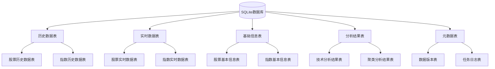

# BeeShare SQLite数据库设计文档

## 数据库概述

BeeShare系统使用SQLite作为主要存储引擎，用于存储A股市场的历史和实时行情数据，以及各类分析结果。SQLite作为一种轻量级关系型数据库，提供了高效的数据存取能力，同时不需要专门的数据库服务器，适合嵌入式应用和单机应用场景。



## 数据表结构设计

### 1. 历史数据表

#### 1.1 股票历史数据表

每只股票的历史数据存储在单独的表中，表名格式：`historical_stock_{股票代码}`

| 列名 | 数据类型 | 说明 | 索引类型 |
|------|--------|------|---------|
| date | TEXT | 交易日期 (YYYY-MM-DD格式) | 主键 + 范围索引 |
| open | REAL | 开盘价 | - |
| high | REAL | 最高价 | - |
| low | REAL | 最低价 | - |
| close | REAL | 收盘价 | 普通索引 |
| volume | REAL | 成交量（手） | 普通索引 |
| amount | REAL | 成交额（元） | - |
| change_pct | REAL | 涨跌幅（%） | 普通索引 |
| change | REAL | 涨跌额（元） | - |
| turnover | REAL | 换手率（%） | - |
| adj_factor | REAL | 复权因子 | - |
| created_at | TEXT | 记录创建时间 | - |
| updated_at | TEXT | 记录更新时间 | - |

**索引设计**：
```sql
-- 主键索引(自动创建)
PRIMARY KEY(date)

-- 日期范围索引(新增)
CREATE INDEX idx_historical_stock_{股票代码}_date ON historical_stock_{股票代码}(date);

-- 收盘价索引
CREATE INDEX idx_historical_stock_{股票代码}_close ON historical_stock_{股票代码}(close);

-- 成交量索引
CREATE INDEX idx_historical_stock_{股票代码}_volume ON historical_stock_{股票代码}(volume);

-- 涨跌幅索引
CREATE INDEX idx_historical_stock_{股票代码}_change_pct ON historical_stock_{股票代码}(change_pct);
```

#### 1.2 指数历史数据表

指数历史数据表名格式：`historical_index_{指数代码}`

| 列名 | 数据类型 | 说明 | 索引类型 |
|------|--------|------|---------|
| date | TEXT | 交易日期 (YYYY-MM-DD格式) | 主键 + 范围索引 |
| open | REAL | 开盘点位 | - |
| high | REAL | 最高点位 | - |
| low | REAL | 最低点位 | - |
| close | REAL | 收盘点位 | 普通索引 |
| volume | REAL | 成交量（手） | - |
| amount | REAL | 成交额（元） | - |
| change_pct | REAL | 涨跌幅（%） | 普通索引 |
| change | REAL | 涨跌额（点） | - |
| created_at | TEXT | 记录创建时间 | - |
| updated_at | TEXT | 记录更新时间 | - |

**索引设计**：
```sql
-- 主键索引(自动创建)
PRIMARY KEY(date)

-- 日期范围索引(新增)
CREATE INDEX idx_historical_index_{指数代码}_date ON historical_index_{指数代码}(date);

-- 收盘点位索引
CREATE INDEX idx_historical_index_{指数代码}_close ON historical_index_{指数代码}(close);

-- 涨跌幅索引
CREATE INDEX idx_historical_index_{指数代码}_change_pct ON historical_index_{指数代码}(change_pct);
```

### 2. 实时数据表

#### 2.1 股票实时数据表

实时数据按日期存储，表名格式：`realtime_stock_{日期}`，例如`realtime_stock_20230101`

| 列名 | 数据类型 | 说明 | 索引类型 |
|------|--------|------|---------|
| symbol | TEXT | 股票代码 | 主键的一部分 |
| time | TEXT | 数据时间 (HH:MM:SS格式) | 主键的一部分 + 复合索引 |
| date | TEXT | 交易日期 | 复合索引 |
| name | TEXT | 股票名称 | - |
| open | REAL | 开盘价 | - |
| high | REAL | 最高价 | - |
| low | REAL | 最低价 | - |
| close | REAL | 当前价/收盘价 | - |
| pre_close | REAL | 昨收价 | - |
| volume | REAL | 成交量（手） | - |
| amount | REAL | 成交额（元） | - |
| change_pct | REAL | 涨跌幅（%） | 普通索引 |
| change | REAL | 涨跌额（元） | - |
| bid_price | REAL | 买一价 | - |
| bid_volume | REAL | 买一量（手） | - |
| ask_price | REAL | 卖一价 | - |
| ask_volume | REAL | 卖一量（手） | - |
| created_at | TEXT | 记录创建时间 | - |

**索引设计**：
```sql
-- 主键索引(自动创建)
PRIMARY KEY(symbol, time)

-- 时间和日期复合索引(新增)
CREATE INDEX idx_realtime_stock_{日期}_time_date ON realtime_stock_{日期}(time, date);

-- 涨跌幅索引
CREATE INDEX idx_realtime_stock_{日期}_change_pct ON realtime_stock_{日期}(change_pct);

-- 股票代码索引
CREATE INDEX idx_realtime_stock_{日期}_symbol ON realtime_stock_{日期}(symbol);
```

#### 2.2 指数实时数据表

指数实时数据表名格式：`realtime_index_{日期}`

| 列名 | 数据类型 | 说明 | 索引类型 |
|------|--------|------|---------|
| symbol | TEXT | 指数代码 | 主键的一部分 |
| time | TEXT | 数据时间 (HH:MM:SS格式) | 主键的一部分 + 复合索引 |
| date | TEXT | 交易日期 | 复合索引 |
| name | TEXT | 指数名称 | - |
| open | REAL | 开盘点位 | - |
| high | REAL | 最高点位 | - |
| low | REAL | 最低点位 | - |
| close | REAL | 当前点位 | - |
| pre_close | REAL | 昨收点位 | - |
| volume | REAL | 成交量（手） | - |
| amount | REAL | 成交额（元） | - |
| change_pct | REAL | 涨跌幅（%） | 普通索引 |
| change | REAL | 涨跌额（点） | - |
| created_at | TEXT | 记录创建时间 | - |

**索引设计**：
```sql
-- 主键索引(自动创建)
PRIMARY KEY(symbol, time)

-- 时间和日期复合索引(新增)
CREATE INDEX idx_realtime_index_{日期}_time_date ON realtime_index_{日期}(time, date);

-- 涨跌幅索引
CREATE INDEX idx_realtime_index_{日期}_change_pct ON realtime_index_{日期}(change_pct);
```

### 3. 基础信息表

#### 3.1 股票信息表

表名：`stock_info`

| 列名 | 数据类型 | 说明 | 索引类型 |
|------|--------|------|---------|
| symbol | TEXT | 股票代码 | 主键 |
| name | TEXT | 股票名称 | 普通索引 |
| market | TEXT | 市场（沪市/深市） | 普通索引 |
| exchange | TEXT | 交易所（SSE/SZSE） | - |
| board | TEXT | 板块（主板/创业板/科创板等） | 普通索引 |
| industry | TEXT | 所属行业 | 普通索引 |
| list_date | TEXT | 上市日期 | - |
| is_st | INTEGER | 是否ST股票(0/1) | - |
| total_share | REAL | 总股本（万股） | - |
| float_share | REAL | 流通股本（万股） | - |
| area | TEXT | 地区 | - |
| created_at | TEXT | 记录创建时间 | - |
| updated_at | TEXT | 记录更新时间 | - |

**索引设计**：
```sql
-- 主键索引(自动创建)
PRIMARY KEY(symbol)

-- 股票名称索引
CREATE INDEX idx_stock_info_name ON stock_info(name);

-- 市场索引
CREATE INDEX idx_stock_info_market ON stock_info(market);

-- 板块索引
CREATE INDEX idx_stock_info_board ON stock_info(board);

-- 行业索引
CREATE INDEX idx_stock_info_industry ON stock_info(industry);
```

#### 3.2 指数信息表

表名：`index_info`

| 列名 | 数据类型 | 说明 | 索引类型 |
|------|--------|------|---------|
| symbol | TEXT | 指数代码 | 主键 |
| name | TEXT | 指数名称 | 普通索引 |
| market | TEXT | 市场（沪市/深市/港股/美股） | 普通索引 |
| publisher | TEXT | 发布机构 | - |
| base_date | TEXT | 基期 | - |
| base_point | REAL | 基点 | - |
| component_count | INTEGER | 成分股数量 | - |
| description | TEXT | 指数描述 | - |
| created_at | TEXT | 记录创建时间 | - |
| updated_at | TEXT | 记录更新时间 | - |

**索引设计**：
```sql
-- 主键索引(自动创建)
PRIMARY KEY(symbol)

-- 指数名称索引
CREATE INDEX idx_index_info_name ON index_info(name);

-- 市场索引
CREATE INDEX idx_index_info_market ON index_info(market);
```

### 4. 分析结果表

#### 4.1 技术分析结果表

表名：`technical_analysis_{股票代码}_{分析类型}`，例如`technical_analysis_600519_ma`

| 列名 | 数据类型 | 说明 | 索引类型 |
|------|--------|------|---------|
| date | TEXT | 分析日期 | 主键 |
| indicator_value | REAL | 指标值 | - |
| parameters | TEXT | 分析参数（JSON格式） | - |
| signal | TEXT | 信号（买入/卖出/持有） | 普通索引 |
| created_at | TEXT | 记录创建时间 | - |

**索引设计**：
```sql
-- 主键索引(自动创建)
PRIMARY KEY(date)

-- 信号索引
CREATE INDEX idx_tech_analysis_{股票代码}_{分析类型}_signal ON technical_analysis_{股票代码}_{分析类型}(signal);
```

#### 4.2 聚类分析结果表

表名：`clustering_result_{分析ID}`

| 列名 | 数据类型 | 说明 | 索引类型 |
|------|--------|------|---------|
| id | INTEGER | 结果ID | 主键 |
| date | TEXT | 分析日期 | 普通索引 |
| symbols | TEXT | 分析的股票代码（JSON数组） | - |
| cluster_count | INTEGER | 聚类数量 | - |
| method | TEXT | 聚类方法 | - |
| features | TEXT | 用于聚类的特征（JSON数组） | - |
| result | TEXT | 聚类结果（JSON格式） | - |
| created_at | TEXT | 记录创建时间 | - |

**索引设计**：
```sql
-- 主键索引(自动创建)
PRIMARY KEY(id)

-- 日期索引
CREATE INDEX idx_clustering_result_{分析ID}_date ON clustering_result_{分析ID}(date);
```

### 5. 元数据表

#### 5.1 数据版本表

表名：`data_version`

| 列名 | 数据类型 | 说明 | 索引类型 |
|------|--------|------|---------|
| data_type | TEXT | 数据类型 | 主键 |
| version | TEXT | 版本号 | - |
| last_update | TEXT | 最后更新时间 | 普通索引 |
| description | TEXT | 描述信息 | - |

**索引设计**：
```sql
-- 主键索引(自动创建)
PRIMARY KEY(data_type)

-- 更新时间索引
CREATE INDEX idx_data_version_last_update ON data_version(last_update);
```

#### 5.2 任务日志表

表名：`task_log`

| 列名 | 数据类型 | 说明 | 索引类型 |
|------|--------|------|---------|
| id | INTEGER | 日志ID | 主键 |
| task_type | TEXT | 任务类型 | 普通索引 |
| start_time | TEXT | 开始时间 | 普通索引 |
| end_time | TEXT | 结束时间 | - |
| status | TEXT | 状态（成功/失败） | 普通索引 |
| details | TEXT | 详细信息 | - |
| error_message | TEXT | 错误信息 | - |

**索引设计**：
```sql
-- 主键索引(自动创建)
PRIMARY KEY(id AUTOINCREMENT)

-- 任务类型索引
CREATE INDEX idx_task_log_task_type ON task_log(task_type);

-- 开始时间索引
CREATE INDEX idx_task_log_start_time ON task_log(start_time);

-- 状态索引
CREATE INDEX idx_task_log_status ON task_log(status);
```

## 实现上述索引的SQL脚本

以下脚本用于实现用户特别关注的索引优化：

### 1. 为历史数据表创建日期范围索引

```sql
-- 为所有股票历史数据表创建日期范围索引
-- 假设我们有一个存储所有股票代码的表stock_info
SELECT 'CREATE INDEX IF NOT EXISTS idx_historical_stock_' || symbol || '_date ON historical_stock_' || symbol || '(date);'
FROM stock_info;

-- 为所有指数历史数据表创建日期范围索引
-- 假设我们有一个存储所有指数代码的表index_info
SELECT 'CREATE INDEX IF NOT EXISTS idx_historical_index_' || symbol || '_date ON historical_index_' || symbol || '(date);'
FROM index_info;

-- 也可以直接手动为特定股票创建
CREATE INDEX IF NOT EXISTS idx_historical_stock_600519_date ON historical_stock_600519(date);
CREATE INDEX IF NOT EXISTS idx_historical_stock_000001_date ON historical_stock_000001(date);
-- 等等
```

### 2. 为实时数据表创建时间和日期的复合索引

```sql
-- 为当前日期的实时数据表创建复合索引
-- 假设今天是2023-01-01
CREATE INDEX IF NOT EXISTS idx_realtime_stock_20230101_time_date ON realtime_stock_20230101(time, date);
CREATE INDEX IF NOT EXISTS idx_realtime_index_20230101_time_date ON realtime_index_20230101(time, date);

-- 也可以通过脚本自动为所有实时数据表创建
SELECT 'CREATE INDEX IF NOT EXISTS idx_' || name || '_time_date ON ' || name || '(time, date);'
FROM sqlite_master
WHERE type='table' AND name LIKE 'realtime_stock_%' OR name LIKE 'realtime_index_%';
```

## 索引优化说明

### 1. 历史数据表的date字段索引

虽然date字段已经是主键并自带索引，但为了支持日期范围查询（如查询某段时间内的股票数据），额外创建了日期范围索引。这对于以下场景特别有用：

- 分析特定时间段内的股票表现
- 计算某段时间内的技术指标
- 获取最近N天的交易数据

### 2. 实时数据表的time和date复合索引

创建time和date的复合索引，主要用于以下查询场景：

- 查询特定时间点的实时行情数据
- 分析某个交易日内不同时间段的价格变化
- 筛选特定时间范围内的高频数据

这个复合索引能显著提高按时间范围筛选数据的查询速度，尤其是在实时数据量较大的情况下。

## 数据库性能优化建议

1. **定期执行VACUUM**
   ```sql
   VACUUM;
   ```
   这将重组数据库文件，回收被删除数据占用的空间。

2. **使用事务处理批量操作**
   ```sql
   BEGIN TRANSACTION;
   -- 多条插入或更新语句
   COMMIT;
   ```
   对于大量数据的插入或更新，使用事务可以显著提高性能。

3. **设置适当的页缓存大小**
   ```sql
   PRAGMA cache_size = 10000; -- 约40MB的缓存
   ```
   增加缓存大小可以减少磁盘I/O，提高查询性能。

4. **表分区策略**
   - 历史数据已按股票代码分表，这是合理的
   - 实时数据按日期分表，方便数据清理和查询

5. **数据压缩**
   对于长期存储的历史数据，可以考虑压缩存储：
   ```sql
   PRAGMA page_size = 4096;
   PRAGMA default_cache_size = 10000;
   PRAGMA journal_mode = OFF;
   PRAGMA locking_mode = EXCLUSIVE;
   PRAGMA synchronous = OFF;
   PRAGMA temp_store = MEMORY;
   ```

## 中文编码处理

SQLite默认使用UTF-8编码，通常能很好地支持中文字符。但在某些环境中可能会出现中文乱码问题，解决方法：

1. **确保Python连接时使用正确的编码**
   ```python
   import sqlite3
   conn = sqlite3.connect('database.db', detect_types=sqlite3.PARSE_DECLTYPES)
   conn.text_factory = str  # 使用Python的str类型处理TEXT
   ```

2. **检查中文字符存储**
   ```sql
   -- 测试中文存储
   CREATE TABLE IF NOT EXISTS test_chinese (id INTEGER PRIMARY KEY, name TEXT);
   INSERT INTO test_chinese (name) VALUES ('测试中文');
   SELECT * FROM test_chinese;
   ```

3. **确保应用程序环境变量**
   在Windows环境中，可能需要设置环境变量确保正确处理中文：
   ```
   set PYTHONIOENCODING=utf-8
   ```

## 数据库文件管理

SQLite数据库保存为单一文件，建议采取以下管理措施：

1. **备份策略**
   - 定期备份数据库文件（每日或每周）
   - 使用SQLite的备份命令：
     ```
     sqlite3 stock_data.db ".backup backup_file.db"
     ```
   - 可以设置自动备份脚本

2. **数据库文件位置**
   - 默认位置：`./data/stock_data.db`
   - 确保存储位置有足够的磁盘空间

3. **数据清理策略**
   - 实时数据可设置保留期限（如30天）
   - 超过保留期的数据表可以删除或归档
   - 可以创建自动清理脚本：
     ```python
     # 删除30天前的实时数据表
     import sqlite3
     import datetime
     
     conn = sqlite3.connect('stock_data.db')
     cursor = conn.cursor()
     
     # 获取30天前的日期
     thirty_days_ago = (datetime.datetime.now() - datetime.timedelta(days=30)).strftime('%Y%m%d')
     
     # 获取所有实时数据表
     cursor.execute("SELECT name FROM sqlite_master WHERE type='table' AND name LIKE 'realtime_stock_%'")
     tables = cursor.fetchall()
     
     # 删除旧表
     for table in tables:
         table_name = table[0]
         table_date = table_name.split('_')[-1]
         if table_date < thirty_days_ago:
             cursor.execute(f"DROP TABLE {table_name}")
             print(f"Dropped table {table_name}")
     
     conn.commit()
     conn.close()
     ```

## 总结

本文档详细介绍了BeeShare系统SQLite数据库的设计，包括各个表的结构、字段说明和索引优化策略。特别落实了两个关键的索引优化建议：

1. 为历史数据表的date字段创建专门的范围索引，优化日期范围查询
2. 为实时数据表创建time和date的复合索引，提高时间相关查询的性能

通过这些优化，可以显著提高系统在大量数据条件下的查询性能，为用户提供更快速的数据访问体验。 