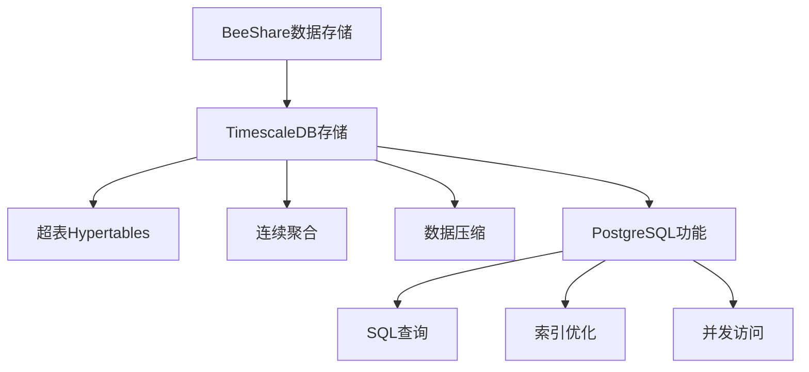

# BeeShare系统存储方案指南

## 概述

BeeShare系统使用TimescaleDB作为主要的数据存储方案。TimescaleDB是PostgreSQL的扩展，专为时间序列数据优化，特别适合股票历史数据等时间序列数据的存储和分析。



## TimescaleDB存储的优势

TimescaleDB是一个高性能的时间序列数据库，在处理时间序列数据方面具有以下优势：

| 特性 | 说明 |
|------|------|
| 高性能时间序列处理 | 针对时间序列数据优化的查询性能 |
| 超表(Hypertables) | 透明分区的时间序列表，提高查询效率 |
| 数据压缩 | 自动压缩历史数据，节省存储空间 |
| 连续聚合 | 实时物化视图，加速聚合查询 |
| PostgreSQL兼容 | 完全支持标准SQL和PostgreSQL功能 |
| 并发处理 | 优秀的并发读写性能 |
| 可扩展性 | 可轻松扩展到TB级数据量 |

## 存储方案配置

BeeShare系统的存储配置位于 `config/storage.json` 文件中，该文件的结构如下：

```json
{
    "active_storage": "postgresql",
    "storage_configs": {
        "postgresql": {
            "type": "postgresql",
            "connection": {
                "host": "localhost",
                "port": 5432,
                "database": "beeshare_db",
                "user": "beeshare",
                "password": "beeshare123"
            },
            "pool_size": 5,
            "max_overflow": 10,
            "pool_recycle": 3600,
            "echo": false
        }
    }
}
```

配置项说明：
- `active_storage`: 当前激活的存储类型，设置为 "postgresql"
- `storage_configs`: 存储类型的配置
  - `postgresql`: TimescaleDB/PostgreSQL存储配置
    - `connection`: 数据库连接参数
    - `pool_size`: 连接池大小
    - `max_overflow`: 连接池最大溢出连接数
    - `pool_recycle`: 连接池连接回收时间(秒)

## 存储管理命令

BeeShare系统提供了命令行工具用于管理存储：

### 查看存储状态

```bash
python main.py storage --status
```

该命令会显示当前存储的配置信息和连接状态。

### 优化数据库

```bash
python main.py storage --optimize
```

该命令会对数据库进行优化，包括重建索引、整理碎片等操作。

## TimescaleDB存储详解

### 数据库结构

TimescaleDB存储使用以下表结构存储数据：

1. **stocks表**: 存储股票基本信息
   - symbol: 股票代码 (PRIMARY KEY)
   - name: 股票名称
   - exchange: 交易所
   - sector: 行业板块
   - industry: 细分行业
   - listing_date: 上市日期
   - created_at/updated_at: 创建和更新时间

2. **stock_historical_data表** (超表): 存储股票历史数据
   - time: 时间戳 (分区键)
   - symbol: 股票代码
   - open, high, low, close: 开盘价、最高价、最低价、收盘价
   - volume: 成交量
   - amount: 成交额
   - change_percent: 涨跌幅
   - turnover: 换手率

3. **stock_realtime_data表** (超表): 存储股票实时数据
   - time: 时间戳 (分区键)
   - symbol: 股票代码
   - price: 当前价格
   - volume: 成交量
   - change_percent: 涨跌幅

4. **index_data表** (超表): 存储指数数据
   - time: 时间戳 (分区键)
   - symbol: 指数代码
   - open, high, low, close: 开盘点位、最高点位、最低点位、收盘点位
   - volume: 成交量
   - change_percent: 涨跌幅

5. **technical_indicators表** (超表): 存储技术指标
   - time: 时间戳 (分区键)
   - symbol: 股票代码
   - indicator_type: 指标类型
   - value: 指标值
   - parameters: 计算参数 (JSONB类型)

6. **analysis_results表**: 存储分析结果
   - id: 结果ID (PRIMARY KEY)
   - analysis_type: 分析类型
   - parameters: 分析参数 (JSONB类型)
   - result: 分析结果 (JSONB类型)
   - created_at: 创建时间

7. **clustering_results表**: 存储聚类分析结果
   - id: 结果ID (PRIMARY KEY)
   - symbols: 股票代码数组
   - features: 特征列表
   - n_clusters: 聚类数量
   - clusters: 聚类结果 (JSONB类型)
   - created_at: 创建时间

### TimescaleDB特有功能

#### 超表(Hypertables)

超表是TimescaleDB的核心功能，它将大型时间序列表透明地分割成多个"分块"，提高查询和插入性能：

```sql
-- 创建超表示例
SELECT create_hypertable('stock_historical_data', 'time');
```

#### 连续聚合(Continuous Aggregates)

连续聚合是TimescaleDB的物化视图，可自动保持最新状态：

```sql
-- 创建连续聚合示例
CREATE MATERIALIZED VIEW daily_price_summary
WITH (timescaledb.continuous)
AS SELECT
    time_bucket('1 day', time) AS day,
    symbol,
    first(open, time) AS open,
    max(high) AS high,
    min(low) AS low,
    last(close, time) AS close,
    sum(volume) AS volume
FROM stock_historical_data
GROUP BY day, symbol;
```

#### 数据压缩(Compression)

TimescaleDB可以自动压缩老旧数据，节省存储空间：

```sql
-- 配置压缩示例
ALTER TABLE stock_historical_data SET (
    timescaledb.compress,
    timescaledb.compress_segmentby = 'symbol'
);

-- 设置压缩策略
SELECT add_compression_policy('stock_historical_data', INTERVAL '90 days');
```

### 优化特性

TimescaleDB存储模块具有以下优化特性：

1. **连接池管理**: 避免频繁创建和关闭连接，提高性能
2. **查询索引**: 为常用查询添加索引，提高查询速度
3. **分区优化**: 自动分区时间序列数据，提高查询效率
4. **数据压缩**: 自动压缩历史数据，节省存储空间
5. **连续聚合**: 预计算常用聚合查询，提高查询速度

## 最佳实践

### 大数据处理

处理大量股票数据时的建议：

1. **使用超表**: 将大型时间序列表配置为超表
2. **连续聚合**: 对常用聚合查询创建连续聚合
3. **压缩历史数据**: 对老旧数据启用压缩
4. **适当分区**: 根据数据量调整分区策略
5. **使用时间过滤**: 总是在查询中包含时间过滤条件

### 并发访问

多个程序同时访问数据库时的建议：

1. **使用连接池**: 管理数据库连接
2. **事务管理**: 合理使用事务，避免长事务
3. **连接超时设置**: 设置合理的连接超时
4. **异步操作**: 考虑使用异步数据库操作

## 故障排除

### 常见问题

1. **连接问题**
   - 问题: "could not connect to server"
   - 解决: 检查PostgreSQL服务是否运行，连接参数是否正确

2. **查询超时**
   - 问题: "canceling statement due to statement timeout"
   - 解决: 优化查询，增加语句超时设置

3. **磁盘空间不足**
   - 问题: "could not extend file"
   - 解决: 清理磁盘空间，压缩历史数据，或增加存储

### 定期维护

为保持最佳性能，建议定期执行以下维护操作：

```bash
# 查看超表状态
sudo -u postgres psql -d beeshare_db -c "SELECT * FROM timescaledb_information.hypertables;"

# 优化数据库
python main.py storage --optimize

# 备份数据库
pg_dump -U beeshare -d beeshare_db > beeshare_backup_$(date +%Y%m%d).sql
```

## 附录：TimescaleDB工具推荐

1. **pgAdmin 4**: 功能强大的PostgreSQL图形化管理工具
2. **DBeaver**: 通用数据库管理工具，支持TimescaleDB
3. **psql**: PostgreSQL命令行工具
4. **Grafana**: 与TimescaleDB结合使用的可视化工具
