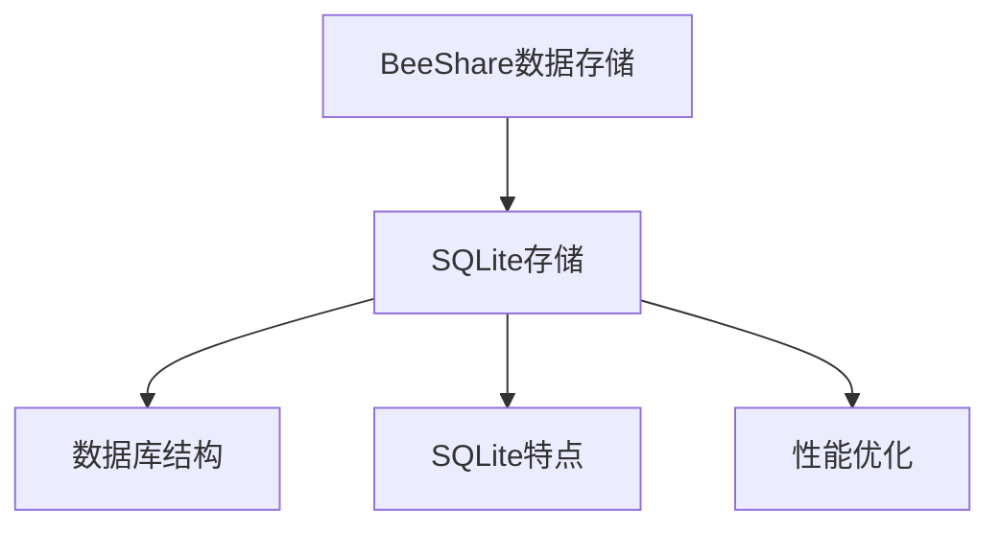

# BeeShare系统存储方案指南

## 概述

BeeShare系统使用SQLite数据库作为唯一的数据存储方案。本文档详细介绍SQLite存储的特点、使用方法和管理工具。



## SQLite存储的优势

SQLite是一个轻量级的关系型数据库，具有以下优势：

| 特性 | 说明 |
|------|------|
| 单文件数据库 | 所有数据存储在单一文件中，便于管理和备份 |
| 强大的查询能力 | 支持标准SQL和复杂查询 |
| 大数据性能 | 对大量数据的处理性能良好 |
| 事务支持 | 确保数据一致性和完整性 |
| 并发访问 | 支持多线程并发访问 |
| 轻量级 | 无需服务器进程，嵌入应用程序中运行 |
| 跨平台 | 支持所有主流操作系统 |

## 存储方案配置

BeeShare系统的存储配置位于 `config/storage.json` 文件中，该文件的结构如下：

```json
{
    "active_storage": "sqlite",
    "storage_configs": {
        "sqlite": {
            "db_path": "data/stock_data.db"
        }
    }
}
```

配置项说明：
- `active_storage`: 当前激活的存储类型，始终为 "sqlite"
- `storage_configs`: 存储类型的配置
  - `sqlite.db_path`: SQLite数据库文件路径

## 存储管理命令

BeeShare系统提供了命令行工具用于管理存储：

### 查看存储状态

```bash
python main.py storage --status
```

该命令会显示当前存储的配置信息。

### 优化SQLite数据库

```bash
python main.py storage --optimize
```

该命令会对SQLite数据库进行优化，包括重建索引、整理碎片等操作。这对于提高查询性能和减少数据库文件大小非常有用。

## SQLite存储详解

### 数据库结构

SQLite存储使用以下表结构存储数据：

1. **symbols表**: 存储股票代码信息
   - symbol: 股票代码 (PRIMARY KEY)
   - name: 股票名称
   - market: 市场类型
   - industry: 行业分类
   - updated_at: 更新时间

2. **indices表**: 存储指数数据
   - symbol: 指数代码
   - date: 日期
   - open, high, low, close: 开盘价、最高价、最低价、收盘价
   - volume: 成交量
   - change_pct: 涨跌幅
   - PRIMARY KEY(symbol, date)

3. **historical_{symbol}表**: 存储每只股票的历史数据
   - date: 日期 (PRIMARY KEY)
   - open, high, low, close: 开盘价、最高价、最低价、收盘价
   - volume: 成交量
   - turnover: 换手率
   - change_pct: 涨跌幅

4. **realtime_{symbol}表**: 存储每只股票的实时数据
   - timestamp: 时间戳 (PRIMARY KEY)
   - price: 当前价格
   - volume: 成交量
   - bid_price, ask_price: 买入价、卖出价
   - bid_volume, ask_volume: 买入量、卖出量
   - change_pct: 涨跌幅

### 优化特性

SQLite存储模块具有以下优化特性：

1. **连接池管理**: 避免频繁创建和关闭连接，提高性能
2. **查询索引**: 为常用查询添加索引，提高查询速度
3. **批量操作**: 使用事务和批量插入提高写入性能
4. **查询缓存**: 缓存常用查询结果，减少数据库访问
5. **WAL模式**: 使用写前日志模式提高并发写入性能

### 性能调优

如果您需要处理大量数据，可以考虑以下SQLite性能调优策略：

1. **增加缓存大小**: 通过 `PRAGMA cache_size` 设置更大的缓存
2. **调整同步模式**: 通过 `PRAGMA synchronous` 调整同步模式
3. **使用内存数据库**: 对于临时数据，考虑使用内存数据库
4. **定期执行VACUUM**: 整理数据库文件减少碎片
5. **分析查询**: 使用 `EXPLAIN QUERY PLAN` 分析和优化查询

## 最佳实践

### 大数据处理

处理大量股票数据时的建议：

1. **索引优化**: 为频繁查询的列添加索引
2. **批量操作**: 使用事务包裹批量操作提高性能
3. **减少查询复杂度**: 避免使用复杂的子查询和JOIN
4. **定期维护**: 定期执行VACUUM和ANALYZE命令

### 并发访问

多个程序同时访问数据库时的建议：

1. **使用WAL模式**: 提高并发读写性能
2. **合理设置超时**: 避免长时间锁定
3. **错误重试**: 对"database is locked"错误进行重试处理

## 故障排除

### 常见问题

1. **数据库锁定错误**
   - 问题: "database is locked"
   - 解决: 确保没有其他程序正在访问数据库，或重启应用

2. **磁盘空间不足**
   - 问题: "disk I/O error"
   - 解决: 清理磁盘空间或使用 `VACUUM` 压缩数据库

3. **数据库损坏**
   - 问题: "database disk image is malformed"
   - 解决: 从备份恢复或使用 `sqlite3_recover` 工具修复

### 定期维护

为保持最佳性能，建议定期执行以下维护操作：

```bash
# 优化SQLite数据库
python main.py storage --optimize

# 备份数据库
cp data/stock_data.db data/stock_data_backup_$(date +%Y%m%d).db
```

## 附录：SQLite工具推荐

1. **DB Browser for SQLite**: 可视化SQLite数据库管理工具
2. **sqlite3命令行工具**: SQLite自带的命令行工具
3. **SQLite Expert**: 专业的SQLite数据库管理工具
4. **SQLiteStudio**: 开源的SQLite数据库管理工具 