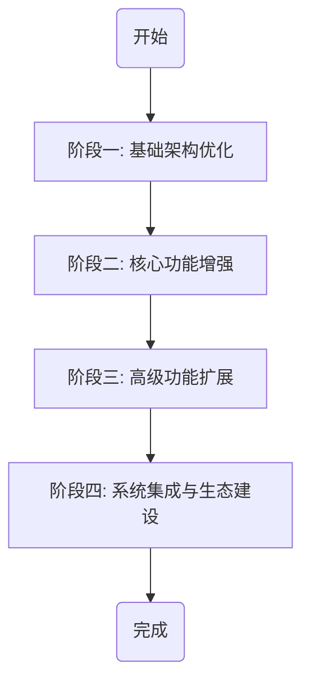

# BeeShare系统改进建议文档

## 引言

本文档基于对BeeShare系统（原中国A股数据获取系统）的全面分析，提供了分步骤的系统优化建议。这些建议按照优先级、实施难度和依赖关系排序，旨在帮助您有序地改进系统架构、扩展功能、提升性能和增强用户体验。

## 系统评估摘要

BeeShare系统目前已具备A股数据获取、存储和分析的基本功能，但在架构设计、模块化程度、性能优化和功能扩展方面仍有提升空间。系统的主要优势在于聚类分析功能完善，而主要挑战在于架构耦合度高、数据源单一和存储方式受限。



## 阶段一：基础架构优化（1-2个月）

### 步骤1.1：重构数据源模块

**问题**：当前系统与AKShare数据源耦合度高，不利于扩展其他数据源。

**改进措施**：
1. 创建抽象数据源接口（`DataSourceInterface`）
2. 将AKShare实现重构为该接口的具体实现（`AKShareDataSource`）
3. 改进数据源初始化和错误处理机制
4. 实现数据源配置统一管理

**实施建议**：
```python
# 示例代码：抽象数据源接口
class DataSourceInterface:
    def get_historical_data(self, symbol, start_date, end_date, interval):
        """获取历史数据的抽象方法"""
        raise NotImplementedError

    def get_realtime_data(self, symbols):
        """获取实时数据的抽象方法"""
        raise NotImplementedError
        
    # 其他抽象方法...

# AKShare实现
class AKShareDataSource(DataSourceInterface):
    def get_historical_data(self, symbol, start_date, end_date, interval):
        # AKShare具体实现...
        pass
```

### 步骤1.2：优化存储层设计

**问题**：当前仅支持CSV存储，不利于高效查询和大数据处理。

**改进措施**：
1. 创建存储引擎抽象接口（`StorageInterface`）
2. 重构CSV存储为该接口的实现（`CSVStorage`）
3. 添加SQLite存储实现（`SQLiteStorage`）
4. 实现存储配置管理和自动迁移功能

**实施建议**：
- 优先完成抽象接口设计
- 确保向后兼容已存储的CSV数据
- 添加数据验证和完整性检查

### 步骤1.3：改进日志和异常处理

**问题**：当前日志系统功能简单，异常处理不够全面。

**改进措施**：
1. 引入结构化日志，区分DEBUG、INFO、WARNING、ERROR级别
2. 增加详细的异常捕获和处理机制
3. 实现关键操作的日志记录和错误恢复
4. 添加系统状态监控日志

**实施建议**：
- 使用Python标准库logging模块
- 针对不同模块设置适当的日志级别
- 为关键异常添加详细的错误代码和说明

### 步骤1.4：重构命令行接口

**问题**：命令行参数处理集中在main.py，不利于功能扩展。

**改进措施**：
1. 采用命令模式设计模式重构命令行接口
2. 实现命令注册机制，支持动态添加命令
3. 改进帮助文档和参数验证
4. 添加命令别名和批处理支持

**实施建议**：
- 保持与现有命令行参数的兼容性
- 提供详细的命令使用示例
- 添加交互式命令模式（可选）

## 阶段二：核心功能增强（2-3个月）

### 步骤2.1：实现数据管理器

**问题**：缺乏统一的数据访问和管理层。

**改进措施**：
1. 创建数据管理器（`DataManager`）统一管理数据获取、转换和存储
2. 实现数据缓存机制，减少重复获取
3. 添加数据更新策略（定时更新、差量更新）
4. 实现数据质量检查和自动修复

**实施建议**：
```python
# 数据管理器示例
class DataManager:
    def __init__(self, data_source, storage):
        self.data_source = data_source
        self.storage = storage
        self.cache = {}  # 简单内存缓存
        
    def get_data(self, data_type, symbol, start_date=None, end_date=None, use_cache=True):
        """统一数据获取入口"""
        # 检查缓存
        # 检查本地存储
        # 如果需要，从数据源获取
        # 更新缓存和存储
        pass
```

### 步骤2.2：增强分析模块

**问题**：分析功能分散，缺乏统一接口和扩展性。

**改进措施**：
1. 创建分析管理器（`AnalysisManager`）统一管理各类分析功能
2. 重构技术分析、基本面分析和聚类分析为插件式架构
3. 添加分析结果缓存和复用机制
4. 实现分析流程编排功能

**实施建议**：
- 设计分析插件接口
- 将现有分析功能迁移到新架构
- 添加示例分析流程配置

### 步骤2.3：扩展数据源支持

**问题**：仅支持AKShare数据源，获取数据类型有限。

**改进措施**：
1. 添加至少一个备用A股数据源实现
2. 实现多数据源结果合并和冲突解决
3. 扩展支持的数据类型（如板块数据、资金流向、融资融券等）
4. 增加数据源健康检查和自动切换机制

**实施建议**：
- 研究和选择合适的备用数据源
- 实现数据源优先级和轮询机制
- 添加数据源对比工具，验证数据一致性

### 步骤2.4：优化存储性能

**问题**：CSV存储在大数据量下性能不佳，查询效率低。

**改进措施**：
1. 实现分区存储策略，按时间或股票代码分区
2. 添加数据索引和查询优化
3. 实现数据压缩和归档机制
4. 添加数据备份和恢复功能

**实施建议**：
- 测试不同存储方式的性能
- 实现渐进式数据迁移
- 提供数据维护工具

## 阶段三：高级功能扩展（3-4个月）

### 步骤3.1：实现回测系统

**问题**：缺乏验证分析结果和策略的回测功能。

**改进措施**：
1. 设计并实现基础回测引擎
2. 支持自定义策略编写和测试
3. 添加回测结果分析和可视化
4. 实现参数优化和蒙特卡洛模拟

**实施建议**：
- 支持Python脚本定义策略
- 提供常用策略模板
- 实现回测结果报告生成

### 步骤3.2：开发Web界面

**问题**：仅有命令行界面，不便于数据浏览和分析结果展示。

**改进措施**：
1. 设计并实现简洁的Web后端（使用Flask或FastAPI）
2. 开发数据浏览和可视化前端
3. 实现分析任务的创建和管理
4. 添加用户认证和权限管理

**实施建议**：
- 采用轻量级设计，优先实现核心功能
- 使用现代前端框架（如Vue.js）
- 支持移动设备访问

### 步骤3.3：增强机器学习能力

**问题**：现有聚类分析基础好，但缺乏预测和异常检测能力。

**改进措施**：
1. 集成基础机器学习模型（回归、分类）
2. 实现市场异常检测功能
3. 添加模型训练和评估工具
4. 开发模型应用和结果解释功能

**实施建议**：
- 从简单模型开始，逐步增加复杂度
- 提供预训练模型和自定义训练选项
- 实现模型性能评估和比较工具

### 步骤3.4：增加宏观数据和行业分析

**问题**：缺乏宏观经济数据和行业分析维度。

**改进措施**：
1. 集成宏观经济数据获取（利用AKShare已有功能）
2. 实现行业板块分析功能
3. 添加宏观数据与个股关联分析
4. 开发行业轮动分析工具

**实施建议**：
- 创建宏观数据和行业数据管理模块
- 实现数据定期更新机制
- 提供行业分类和映射功能

## 阶段四：系统集成与生态建设（4-6个月）

### 步骤4.1：开发API服务

**问题**：缺乏编程接口，难以与其他系统集成。

**改进措施**：
1. 设计RESTful API架构
2. 实现核心数据和分析功能的API
3. 添加API文档和示例
4. 实现API访问控制和限流

**实施建议**：
- 使用OpenAPI/Swagger生成文档
- 提供各语言的客户端示例
- 实现API版本管理

### 步骤4.2：实现插件系统

**问题**：系统扩展依赖于核心代码修改。

**改进措施**：
1. 设计并实现插件架构
2. 将核心功能模块化为内置插件
3. 开发插件管理工具
4. 提供插件开发文档和示例

**实施建议**：
- 定义清晰的插件接口
- 实现插件热加载机制
- 提供插件模板和脚手架

### 步骤4.3：优化多用户支持

**问题**：系统设计主要针对单用户场景。

**改进措施**：
1. 改进配置和数据隔离机制
2. 实现用户管理和权限控制
3. 添加任务队列和资源管理
4. 开发协作功能（共享分析、评论等）

**实施建议**：
- 从单用户多配置支持开始
- 实现基于角色的访问控制
- 添加用户偏好设置

### 步骤4.4：构建数据生态

**问题**：数据孤岛，缺乏与外部系统的数据交换。

**改进措施**：
1. 实现数据导入/导出工具
2. 支持常见分析软件的数据格式
3. 开发与Excel、Python、R等工具的集成
4. 实现数据订阅和推送机制

**实施建议**：
- 优先支持CSV、JSON等通用格式
- 开发Excel插件或模板
- 提供Python/R包装器

## 存储层优化

### 已完成的优化

1. **SQLite存储实现**
   - 实现了基于SQLite的数据存储，支持保存、加载和删除操作
   - 添加了表索引以提高查询性能
   - 实现了连接池管理，避免频繁创建连接
   - 添加了查询缓存功能，提高重复查询性能
   - 使用WAL模式提高并发写入性能
   - 支持批量操作，提高批量数据处理性能

2. **存储管理工具**
   - 添加了存储配置管理功能，支持通过配置文件设置存储类型
   - 添加了存储管理命令，支持查看存储状态、切换存储类型等
   - 实现了数据迁移工具，支持在不同存储类型间迁移数据
   - 添加了SQLite数据库优化功能，支持重建索引、整理碎片等

3. **文档更新**
   - 编写了详细的存储方案使用指南
   - 更新了项目README文件，添加了存储管理相关说明
   - 添加了存储迁移工具的使用说明

### 待完成的优化

1. **查询性能优化**
   - 实现更精细的查询缓存策略
   - 添加更多查询索引，针对特定查询模式优化

2. **内存使用优化**
   - 优化大数据集处理时的内存使用
   - 实现数据分页加载功能

3. **更多存储选项**
   - 考虑添加MongoDB或其他NoSQL存储支持
   - 考虑添加分布式存储支持

## 实施建议总结

1. **循序渐进**：按照上述阶段和步骤有序实施，避免大规模重构带来的风险
2. **持续集成**：每完成一个小步骤就进行测试和集成，保持系统可用性
3. **文档先行**：在代码实现前先完善设计文档和接口规范
4. **测试驱动**：为新功能编写测试用例，保证质量和稳定性
5. **兼容性考虑**：确保对现有功能和数据的向后兼容
6. **用户反馈**：在每个阶段结束时收集用户反馈，调整后续计划

## 结论

BeeShare系统已经具备了坚实的基础，通过上述分阶段的改进，可以显著提升系统的架构质量、功能丰富度、性能水平和用户体验。这些改进将使BeeShare从一个数据获取工具，发展成为一个全面的A股数据分析平台，为投资者和研究人员提供更强大的决策支持。

遵循本文档的建议，您可以根据自身资源和优先级，灵活调整各步骤的实施顺序和深度，确保系统的持续改进和长期价值。 