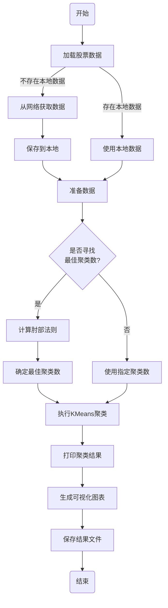

# BeeShare系统使用指南

## 安装依赖

在使用A股数据获取系统之前，请确保安装所有必要的依赖包：

```
pip install -r requirements.txt
```

其中包含了AKShare库，这是系统获取A股数据的核心依赖。

## 基本使用

本系统提供了命令行接口，专注于获取和存储中国A股市场数据。以下是基本的使用方法：

### 获取历史数据

```
python main.py historical --symbol 600036 --start-date 2023-01-01 --end-date 2023-12-31
```

参数说明：
- `--symbol` 或 `-s`：股票代码，例如 600036 (招商银行)、601398 (工商银行)
- `--start-date`：开始日期，格式为 YYYY-MM-DD
- `--end-date`：结束日期，格式为 YYYY-MM-DD
- `--interval`：数据间隔，默认为 1d (日)，可选 1wk (周)、1mo (月) 等
- `--source`：数据源，默认为 akshare
- `--storage`：存储方式，默认为 csv
- `--storage-mode`：存储模式，默认为 append (追加)，可选 overwrite (覆盖)

### 获取实时数据

```
python main.py realtime --symbol 600519,601398
```

或者使用预定义的市场：

```
python main.py realtime --market cn
```

参数说明：
- `--symbol`：股票代码，多个代码用逗号分隔，例如"600519,601398"
- `--market`：市场代码，使用指定市场的默认股票，目前支持cn(中国A股)
- 注意：`--symbol`和`--market`参数至少要提供一个，如果两者都提供，优先使用`--symbol`
- `--source`：数据源，默认为akshare
- `--storage`：存储方式，默认为csv
- `--storage-mode`：存储模式，默认为overwrite(覆盖)

### 搜索股票

```
python main.py search --keyword 银行
```

参数说明：
- `--keyword` 或 `-k`：搜索关键词
- `--source`：数据源，默认为 akshare

### 股票代码识别（新功能）

系统新增了股票代码识别功能，可以自动判断股票所属的市场、交易所和板块：

```
python main.py identify --symbol 600519,001279,300059,688001
```

参数说明：
- `--symbol`：股票代码，多个代码用逗号分隔
- `--source`：数据源，默认为 akshare

该功能可以帮助识别各种类型的股票代码，包括：
- 上交所主板（6开头）：如600519（贵州茅台）
- 上交所科创板（688开头）：如688001（华兴源创）
- 深交所主板（000、001、003开头）：如000001（平安银行）
- 深交所创业板（300开头）：如300059（东方财富）
- 深交所中小板（002开头，已并入主板）：如002594（比亚迪）
- 北交所（4、8开头非688）：如430047（诺思兰德）


### 股票聚类分析（新功能）

系统新增了股票聚类分析功能，可以对多只股票进行KMeans聚类分析，发现相似特征的股票组：

```
python main.py clustering --symbols 600519,601398,600036,000001 --n-clusters 3
```

参数说明：
- `--symbols`：要分析的股票代码，用逗号分隔
- `--start-date`：开始日期，格式为YYYY-MM-DD，默认为90天前
- `--end-date`：结束日期，格式为YYYY-MM-DD，默认为今天
- `--n-clusters`：聚类数量，默认为3
- `--features`：用于聚类的特征，用逗号分隔，默认为"open,close,high,low,volume,change_percent"
- `--find-optimal`：是否自动寻找最佳聚类数量
- `--max-clusters`：寻找最佳聚类数量时的最大聚类数，默认为10
- `--plot-type`：可视化类型，可选值为"all"、"clusters"、"elbow"、"feature_distribution"、"centroids"，默认为"all"
- `--output-dir`：结果输出目录，默认为"results"
- `--use-pca`：是否使用PCA降维进行可视化
- `--plot-3d`：是否绘制3D图
- `--source`：数据源，默认为akshare
- `--storage`：存储方式，默认为csv

详细的聚类分析使用说明参见本文档的"新增功能：聚类分析"部分。

### 获取指数数据

系统支持获取A股主要指数数据，如上证指数、深证成指、沪深300等：

```bash
python main.py index --symbol 000001 --start-date 2023-01-01 --end-date 2023-12-31 --storage csv
```

参数说明：
- `--symbol` 或 `-s`：指数代码，例如 000001 (上证指数)、399001 (深证成指)
- `--start-date`：开始日期，格式为 YYYY-MM-DD
- `--end-date`：结束日期，格式为 YYYY-MM-DD
- `--interval`：数据间隔，默认为 1d (日)，可选 1wk (周)、1mo (月) 等
- `--source`：数据源，默认为 akshare
- `--storage`：存储方式，默认为 csv
- `--storage-mode`：存储模式，默认为 append (追加)，可选 overwrite (覆盖)

**主要指数代码**：
- `000001`：上证指数
- `399001`：深证成指
- `000300`：沪深300
- `000016`：上证50
- `000905`：中证500

## 数据存储

系统默认使用CSV格式存储数据，文件保存在项目的 `data/csv` 目录下。文件名格式为：`{股票代码}_{数据类型}.csv`。

例如：
- 600036的历史数据：`600036_historical.csv`
- 实时数据：`realtime.csv`

## 支持的数据源

目前，系统专注于使用AKShare数据源：

**AKShare** (akshare)：
- 专为中国A股市场设计的金融数据接口包
- 支持历史数据、实时数据、指数数据和股票搜索
- 无需API密钥
- 在中国境内使用无需VPN

## 配置系统

系统的配置文件位于 `config/config.py`，可以根据需要修改以下配置：

1. 数据源配置 (`DATA_SOURCES`)
2. 数据获取配置 (`FETCH_CONFIG`)
3. 存储配置 (`STORAGE_CONFIG`)
4. 市场配置 (`MARKETS`)
5. 日志配置 (`LOG_CONFIG`)

## 示例

1. 获取招商银行最近1个月的历史数据：
   ```
   python main.py historical --symbol 600036 --start-date 2023-12-01
   ```

2. 获取贵州茅台的历史数据：
   ```
   python main.py historical --symbol 600519 --start-date 2023-01-01
   ```

3. 获取A股市场主要指数的历史数据：
   ```
   python main.py index --symbol 000001 --start-date 2023-01-01
   ```

5. 获取深证成指并指定存储模式为覆盖：
   ```
   python main.py index --symbol 399001 --start-date 2023-01-01 --storage-mode overwrite
   ```

6. 获取沪深300指数的周线数据：
   ```
   python main.py index --symbol 000300 --start-date 2023-01-01 --interval 1wk
   ```

7. 识别不同类型的股票代码：
   ```
   python main.py identify --symbol 600519,001279,300059,688001
   ```
   该命令会显示每个股票的市场、交易所和板块信息。

8. 测试深圳主板001开头股票的数据获取：
   ```
   python main.py realtime --symbol 001279
   ```
   系统现在可以正确识别并获取001开头的深圳股票数据。

9. 对银行板块股票进行聚类分析：
   ```
   python main.py clustering --symbols 600036,601398,601288,601328,600000,601818 --find-optimal --max-clusters 5
   ```
   该命令会对6只银行股进行聚类分析，自动寻找最佳聚类数量（最大为5），并生成各类可视化图表。

10. 使用特定特征进行聚类分析：
    ```
    python main.py clustering --symbols 600519,601398,600036,000001 --features close,change_percent,volume,turnover_rate
    ```
    该命令会仅使用收盘价、涨跌幅、成交量和换手率这几个特征进行聚类分析。

## 指数数据测试

如果你想测试AKShare的原始指数API，可以运行：

```
python test_akshare_index.py
```

该脚本直接调用AKShare的API，展示原始指数数据的格式和结构。

## 故障排除

如果遇到问题，请检查：

1. 所有依赖包是否已正确安装
2. 网络连接是否正常（中国大陆用户不需要VPN）
3. 查看日志文件 `logs/stock_data.log` 了解详细错误信息
4. 对于深圳股票代码（特别是001开头的），确保系统版本在0.3.3及以上

## 测试系统

运行测试脚本，验证系统各功能是否正常：

```
python tests/test_basic.py
```

这将测试AKShare数据源连接、数据获取和数据存储功能。 

## 最近更新内容

### 0.3.3版本更新（2023-04-23）：
1. **股票代码智能识别**：新增股票代码识别功能，可判断股票所属交易所和板块
2. **股票代码自动转换**：自动添加正确的交易所前缀，兼容所有A股市场股票
3. **修复001开头股票获取问题**：现在可以正确获取001开头的深圳主板股票数据
4. **实时数据获取优化**：改进数据获取逻辑，提高成功率
5. **股票列表缓存**：提高股票搜索和识别功能的性能 

# 新增功能：聚类分析

## 基本介绍

聚类分析模块使用KMeans算法对股票数据进行分组聚类分析，帮助发现具有相似特征的股票组。该功能可以应用于多种场景：

- 发现具有相似走势的股票
- 对板块内股票进行分类
- 发现潜在的投资组合机会
- 识别异常表现的股票

## 使用方法

```bash
# 基本用法
python main.py clustering --symbols 600519,601398,600036,000001 --n-clusters 3

# 指定时间范围
python main.py clustering --symbols 600519,601398,600036,000001 --start-date 2023-01-01 --end-date 2023-12-31

# 自动寻找最佳聚类数量
python main.py clustering --symbols 600519,601398,600036,000001,000002,600000,601288,000651 --find-optimal --max-clusters 8

# 指定用于聚类的特征
python main.py clustering --symbols 600519,601398,600036,000001 --features open,close,high,low,volume,change_percent,amplitude,turnover_rate

# 指定输出目录
python main.py clustering --symbols 600519,601398,600036,000001 --output-dir results/cluster_analysis

# 指定可视化类型
python main.py clustering --symbols 600519,601398,600036,000001 --plot-type clusters
python main.py clustering --symbols 600519,601398,600036,000001 --plot-type elbow
python main.py clustering --symbols 600519,601398,600036,000001 --plot-type feature_distribution
python main.py clustering --symbols 600519,601398,600036,000001 --plot-type centroids
```

## 参数说明

聚类分析命令支持以下参数：

- `--symbols`: 要分析的股票代码，用逗号分隔，**必需参数**
- `--start-date`: 开始日期，格式为YYYY-MM-DD，默认为90天前
- `--end-date`: 结束日期，格式为YYYY-MM-DD，默认为今天
- `--n-clusters`: 聚类数量，默认为3
- `--features`: 用于聚类的特征，用逗号分隔，默认为"open,close,high,low,volume,change_percent"
- `--find-optimal`: 是否自动寻找最佳聚类数量，不需要值，指定即为True
- `--max-clusters`: 寻找最佳聚类数量时的最大聚类数，默认为10
- `--plot-type`: 可视化类型，可选值为"all", "clusters", "elbow", "feature_distribution", "centroids"，默认为"all"
- `--output-dir`: 结果输出目录，默认为"results"
- `--use-pca`: 是否使用PCA降维进行可视化，不需要值，指定即为True
- `--plot-3d`: 是否绘制3D图，不需要值，指定即为True
- `--source`: 数据源，默认为"akshare"
- `--storage`: 存储方式，默认为"csv"

## 输出结果

聚类分析会生成以下输出：

1. **聚类散点图**：显示不同股票在特征空间中的分布，以及它们所属的聚类
2. **肘部法则图**：帮助确定最佳聚类数量的图表
3. **特征分布图**：显示各个聚类中股票特征的分布情况
4. **聚类中心雷达图**：以雷达图形式显示各个聚类中心点的特征值
5. **聚类结果CSV文件**：包含原始数据及其所属的聚类标签

所有输出文件默认保存在`results`目录下，可通过`--output-dir`参数指定其他目录。

## 高级用法

### 特征选择

聚类分析默认使用以下特征：开盘价、收盘价、最高价、最低价、成交量、涨跌幅。您可以根据需要选择其他特征，例如：

```bash
python main.py clustering --symbols 600519,601398,600036,000001 --features close,change_percent,volume,turnover_rate
```

### 自动寻找最佳聚类数量

系统可以使用"肘部法则"自动寻找最佳聚类数量：

```bash
python main.py clustering --symbols 600519,601398,600036,000001,000002,600000,601288,000651 --find-optimal --max-clusters 8
```

### 使用PCA降维可视化

对于高维特征，可以使用PCA降维后进行可视化：

```bash
python main.py clustering --symbols 600519,601398,600036,000001 --use-pca
```

### 3D可视化

支持3D可视化聚类结果：

```bash
python main.py clustering --symbols 600519,601398,600036,000001 --plot-3d
```

## 常见问题

1. **问题**: 如何知道应该选择多少个聚类？
   **回答**: 可以使用`--find-optimal`参数自动寻找最佳聚类数量，或者通过`--plot-type elbow`绘制肘部法则图自行判断。

2. **问题**: 聚类结果不稳定怎么办？
   **回答**: KMeans算法的初始化是随机的，可能导致结果不稳定。可以多次运行算法，或者使用更多的股票数据来提高稳定性。

3. **问题**: 为什么看不到3D图？
   **回答**: 3D图需要安装额外的依赖，确保已安装matplotlib的3D支持。

4. **问题**: 可以对全市场股票进行聚类吗？
   **回答**: 理论上可以，但处理大量数据可能需要较长时间，建议先在特定板块或行业内进行尝试。 

## 聚类分析工作流程

以下是聚类分析功能的工作流程图，展示了从数据加载到结果输出的整个过程：



通过这个流程图，您可以清楚地了解到聚类分析的整个执行过程。系统会自动处理数据加载、最佳聚类数确定、聚类分析执行和结果可视化等每一步操作。 